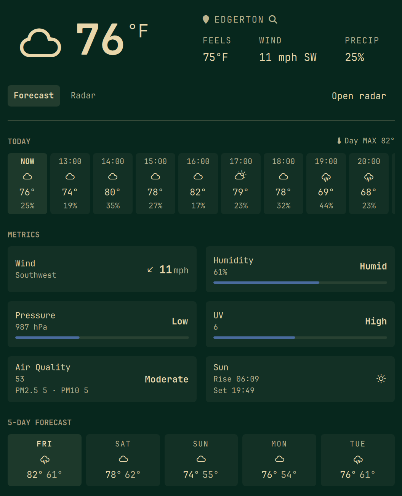

# Detailed Weather

A single Omarchy bar pill that **replaces** the built-in `omarchy.weather`
widget. Click it for today's remaining-hour forecast and a ten-day outlook.
**Open radar** launches a saved radar website in your default browser.

Named to sit next to stock Weather, Weathering, and Weather Radar without
colliding. Plugin id stays `io.github.calebhat.weather`.

No API key. Location is the same file Omarchy already uses.

<p align="center"></p>

## Why this exists

Omarchy's stock weather pill shows current conditions and a short outlook.
[Weathering](https://github.com/howdyitskyle/weathering-omarchy-plugin) is a
richer forecast panel. [Weather Radar](https://github.com/eduardodallecort/omarchy-weather-radar)
is a separate radar pill.

This plugin is the stock header replacement: a richer forecast, peek at
another city without changing home, and **Open radar** to a website you
choose (RainViewer, NOAA, Windy, Weather Underground, or a custom https
URL). There is no in-panel radar map — public tile APIs no longer offer
one consistent past+future product without a paid key.

It is MIT-licensed work adapted from Weathering and Weather Radar plus the
stock weather contract. See [NOTICE.md](NOTICE.md).

## Features

### Bar pill

Intended to stand in for the built-in weather icon in the centre of the
bar (disable `omarchy.weather` so you only have one pill). The icon shows
the current condition glyph for your **saved home** location, even while
the panel is peeking at another city.

| Input | Action |
|-------|--------|
| Left-click | Open or close the panel |
| Middle-click | Refresh the forecast |
| Right-click | Notification from this panel's current reading |
| Escape (panel open) | Close |

### Forecast

Current temperature and condition, feels-like, wind, and precipitation
chance. Below that:

- **Today** — remaining hours of the current local day (not a fixed six-cell
  strip). Scroll sideways if the day is long. The first cell is **NOW**.
- **Metrics** — wind (speed and direction), humidity, pressure, UV, air
  quality (US AQI, PM2.5 / PM10), sunrise and sunset. Each block can be
  hidden in settings.
- **Ten-day** — today plus the next nine days, high / low and condition.

Units follow `auto` (locale and country), `metric`, or `imperial`.

### Open radar

**Open radar** on the forecast launches the saved site in your default
browser. Choose the site under **Settings** (RainViewer, NOAA, Windy,
Weather Underground, or Custom). Custom URLs must be `https://…`.
Optional `{lat}` and `{lon}` are filled from the city you are viewing.

### Settings

**Settings** (top-right on the forecast) opens units, 12- or 24-hour clocks,
the radar website, and storm alerts. **Done** (top-left on Settings) returns
to the forecast. Home location stays the pin on the forecast.

### Home location

Shared with stock Omarchy weather:
`~/.local/state/omarchy/settings/weather.json`, via
`omarchy-weather-location`. Click the **pin / city name** to search and
**save** a new home. Enter only accepts a city you picked from the list
(or the only match). Empty Enter cancels. The ✕ clears saved location
back to IP auto-detect. Changing home here also moves any other widget
that reads that file.

### Peek

The **search** icon next to the city name looks up another place **without
saving it**.

- Pick a geocoded suggestion (arrow or click). A typed name alone is not enough.
- Forecast, radar, and **Open radar** follow the peeked city
- The bar pill stays on home
- Storm alerts stay on home
- **Back to \<home\>** returns. Peek stays until you do that (closing the panel does not throw it away).

Use peek for “what’s the weather in Madison.” Use the pin to actually move
home.

### Storm alerts (off by default)

Optional. When on, a background check looks at the forecast around **home**
(not a peek) and notifies if rain or a storm is expected inside the alert
radius. Toggle from Settings. Not a life-safety tool — use your national
weather service for decisions that matter.

## Install

```sh
omarchy plugin add https://github.com/calebhat/omarchy-weather.git --enable
omarchy plugin disable omarchy.weather
omarchy bar move io.github.calebhat.weather --section center
omarchy restart shell
```

`--enable` adds this widget; disable the built-in `omarchy.weather` pill so
you do not get two weather icons. Move this one to centre if it landed
elsewhere.

Do not enable this together with Weathering or Weather Radar in the same
bar slot unless you want two weather pills. Disable those if you are
switching.

## Configure

Settings live on the widget’s entry in `~/.config/omarchy/shell.json` (or
the bar settings form). `shell.json` hot-reloads on save.

| Key | Default | Meaning |
|-----|---------|---------|
| `unit` | `auto` | `auto` / `metric` / `imperial` |
| `refreshMinutes` | `15` | Forecast refresh, 5–120 |
| `showHourly` | `true` | Remaining hours for today |
| `showForecast` | `true` | Ten-day strip |
| `showMetrics` | `true` | Wind / humidity / pressure / UV grid |
| `showSun` | `true` | Sunrise / sunset cell |
| `showAirQuality` | `true` | US AQI cell |
| `showFeelsLike` | `true` | Feels-like in the header |
| `alertsEnabled` | `false` | Storm alerts for home |
| `alertRadiusKm` | `100` | How far around home to sample |
| `alertMinIntensity` | `Heavy` | `Light` / `Moderate` / `Heavy` / `Severe` |
| `radarSite` | `RainViewer` | Website Open radar launches |
| `radarUrl` | (empty) | Custom https URL when `radarSite` is Custom |
| `timeFormat` | `24` | `12` or `24` hour clocks |

## Remove

```sh
omarchy plugin remove io.github.calebhat.weather
```

The built-in weather widget comes back. `weather.json` is left alone.

## Data

| Source | Used for |
|--------|----------|
| Open-Meteo | Current, hourly, daily, air quality, city search |
| wttr.in | IP auto-detect when no home coordinates are stored |
| RainViewer / NOAA / Windy / WU | Opened in the browser by Open radar (user's saved site) |

## Security

Plugins run unsandboxed inside `omarchy-shell`. This one:

- Fetches the HTTPS endpoints above
- Writes home location only through `omarchy-weather-location` (argv, no
  shell). Peek never writes that file
- Opens the browser only with `omarchy-launch-browser` and an `https://`
  URL from the saved radar site (custom URLs are sanitized: https only, no
  `javascript:` / `data:` / `file:`)
- Invokes every process as an argv array (`curl`,
  `omarchy-notification-send`, `omarchy-weather-location`). No `bash -c`,
  no `$(…)`, no pipe-to-shell
- Caps JSON bodies (`curl --max-filesize` plus a length check before parse:
  1 MiB forecast, 4 KiB place name)

Right-click on the pill sends a notification built from this panel's current
reading.

## License and external dependencies

MIT — [LICENSE](LICENSE) and [NOTICE.md](NOTICE.md).

No extra packages and no pip. No sudo or pkexec is required. Runtime
network only: Open-Meteo, wttr.in, and the user-chosen radar website
(opened in the default browser). Location is written through
`omarchy-weather-location`.
